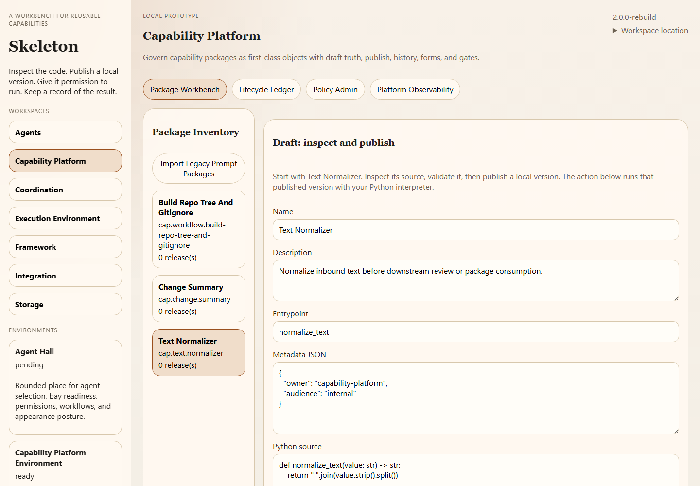

# Skeleton

Skeleton is a local workbench for turning reusable functions into capability packages, giving agents permission to use them, and recording what happens when they run.

The question behind it is: **how can we build systems from reusable pieces without mixing up who controls the code, the permissions, the execution, and the records?** This prototype explores that question with a browser interface, an optional Electron desktop host, and seven services with separate responsibilities.

## Which Skeleton is this?

This repository contains the later **TypeScript rebuild**. It carries forward ideas from an earlier Python workbench, but it is a separate implementation. The earlier workbench and its full set of experiments are not included here. This version stores Python functions as capability packages; it does not provide a visual node-graph editor.

**Status: runnable architectural prototype.** It is useful for exploring package lifecycles, workflow permissions, and recorded execution. It is not a hardened sandbox or a production multi-user service.

**[Follow a complete run](docs/FIRST-RUN.md)** · **[Inspect its result](examples/result.json)** · **[Compare releases and source](examples/trace.json)** · **[Trace the mechanism](docs/DESIGN-WALKTHROUGH.md)**



This is the actual browser interface with synthetic package data. Publishing creates a local version; it does not upload code.

## Try it locally

You need **Node.js 20 or newer** and npm. No model API key is needed. Running the included Python functions also requires **Python 3.10 or newer** on your path; `PYTHON_EXECUTABLE` can select a specific interpreter.

From the repository directory:

```sh
npm ci --ignore-scripts
npm run build
npm run demo
```

The demo starts an isolated local runtime, confirms that an unpublished action is denied, validates and publishes Text Normalizer, and runs its Python function. It returns `hello world` from `"  hello   world  "`. It then edits the draft to uppercase the result: version 1 keeps returning `hello world`, version 2 returns `HELLO WORLD`, and rolling back makes a new version 3 that returns `hello world` again. The original version 1 record remains unchanged.

Each run retains `result.json`, `trace.json` and complete runtime records under a new `.demo-runs/` directory, then stops the runtime. The trace includes exact synthetic source forms, their hashes, request inputs and actual outputs, with assertions that authorization and execution evidence identify the selected release. It makes no model calls and preserves each run. Compare the [captured trace](examples/trace.json).

To explore through the browser:

```sh
npm run start:runtime
```

Open [http://127.0.0.1:4310](http://127.0.0.1:4310). Keep the terminal running while you use the workbench; stop it with Ctrl+C.

A first example:

1. Open **Capability Platform**, then **Package Workbench**.
2. Select **Text Normalizer** and inspect its Python source.
3. Validate the draft, then publish it. In this interface, publishing creates a **local package version**; it does not upload anything.
4. Scroll to **Governed Package Action** and choose **Run Published Action**. The default JSON input returns `sample text` with an execution record.
5. Inspect the published forms, package history, and recorded result. The [walkthrough](docs/FIRST-RUN.md) explains what each step establishes.

The default data directory is `.skeleton-data/` inside the checkout. `PORT`, `SKELETON_DATA_ROOT`, and `SKELETON_PROJECT_ROOT` can override the runtime's port, data directory, and project directory. Historical import controls need an explicitly configured `SKELETON_LEGACY_ROOT`; they have no source in a fresh checkout.

For the optional Electron window, run `npm rebuild electron` after the install above, then `npm run start:desktop`. The desktop host uses port 4310, so stop the browser runtime first. The desktop build stores its data in Electron's application-data directory, separately from the browser runtime.

## What is implemented

- **Capability packages:** edit drafts, validate, create local published versions, inspect generated forms and history, and roll back by creating another publication.
- **Agents and workflows:** inspect agent definitions, configure capability grants and file permissions, preview targets, and retain workflow run records.
- **Execution:** run supported Python package actions through a dispatcher and record completion, denial, or failure. Python code runs with the local process's permissions.
- **Provider settings:** retain provider configuration and online/offline status. This is configuration bookkeeping, not a complete model-comparison or chat application.
- **Local records:** keep owner-scoped JSON records, JSONL events, and artifacts for inspection.

The shipped examples include text normalization, change summaries, a repository-tree workflow, and a synthetic agent. Existing private workbench records are not required.

## How the code is organized

| Location | Responsibility |
| --- | --- |
| `apps/shell/` | Browser interface |
| `apps/runtime/` | Local HTTP API and service composition |
| `apps/desktop/` | Optional Electron host |
| `owners/framework/` | Startup information, registration, and diagnostics |
| `owners/capability-platform/` | Package drafts, versions, validation, and policies |
| `owners/agents/` | Agent records, permissions, and workflows |
| `owners/execution-environment/` | Execution contexts, dispatcher, and run evidence |
| `owners/integration/` | Provider configuration and import controls |
| `owners/coordination/` | Events and workflow handoffs |
| `owners/storage/` | Local persistence |

The [seven ownerships document](docs/THE-7-LAWS-OF-THE-7-OWNERSHIPS.md) explains the design. The [behavior ledger](architecture/BEHAVIOR_LEDGER.md) and [rebuild ledger](architecture/REBUILD_LEDGER.md) retain the migration history. The dated audits under `docs/` describe the broader source workspace at the time; some legacy paths they discuss are not part of this checkout.

## Check the build

```sh
npm run check
npm test
```

The checks compile the TypeScript and build the interface. The smoke test starts a runtime on an available loopback port with temporary data, checks health and initial service inventories, then stops it. The storage regression exercises concurrent reads during repeated record replacement. Neither calls a model provider. `npm run demo` adds the complete publication/execution path. GitHub Actions runs the build and test checks.

For development, `npm run dev:runtime` runs the TypeScript runtime directly. `npm run dev:shell` rebuilds the browser bundle once; it is not a watching development server.

## Limits

The API has no authentication, provider credentials are ordinary local records, and Python execution is not isolated from your machine. Use trusted code and disposable data, keep the runtime on loopback, and read [SECURITY.md](SECURITY.md) before experimenting with credentials or execution. Packaging, stronger persistence, and recovery remain unfinished. The included architectural audits describe further gaps; their historical test claims are not a guarantee of present behavior.

## License

MIT. See [LICENSE.md](LICENSE.md).

