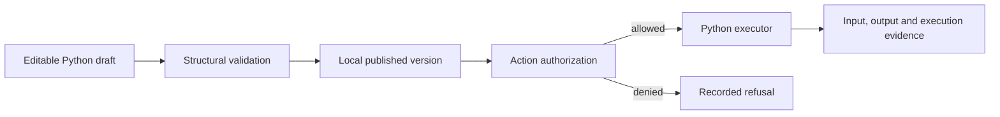

# The mechanism behind the example

Skeleton separates an editable package, a published version, permission to invoke it, the execution, and the records left behind. The distinction matters when code changes after a run: the recorded invocation should still identify the version it used.

| Follow the example | Implementation |
|---|---|
| Browser actions and displayed result | [CapabilityWorkbenchSurface](../apps/shell/src/App.tsx) |
| HTTP boundary and service composition | [Runtime server](../apps/runtime/src/server.ts) |
| Draft, validation, publication, authorization | [Capability platform service](../owners/capability-platform/src/service.ts) |
| Execution and returned evidence | [Bounded executor](../owners/execution-environment/src/executor.ts) |
| Persistent owner records | [Storage service](../owners/storage/src/service.ts) |
| Reproducible end-to-end example | [Example script](../scripts/example.mjs) |

The seven-owner architecture is a proposed organization method, described in the [ownership document](THE-7-LAWS-OF-THE-7-OWNERSHIPS.md). It is not evidence of universal optimality. This source is the later TypeScript workbench; it does not contain the original Python node-graph editor or the historical integrated Mortal Kombat system.

## What this edition established

The documented local route was exercised from a fresh dependency install: compile, build, unpublished refusal, validation, publication, Python execution, and saved output. The actual browser route was inspected at desktop and 390-pixel widths. A mobile overflow in published code blocks was repaired; the interface remains primarily a desktop workbench. Electron and live provider inference were not exercised.

Concurrent read/write testing exposed a storage defect: readers could see a partially written JSON record. Record replacement now writes a distinct temporary file and renames it over the completed record. The [regression](../scripts/storage-atomicity.mjs) repeatedly reads during replacement. This protects record completeness within the tested local store; it does not add database transactions, multiple-process coordination, or crash durability guarantees.

## Build on the interesting seam

Change the Text Normalizer draft, save it, validate it, and publish a second local version. The earlier release remains inspectable. Compare the source form, returned output, and execution identities across versions. For agent-driven execution, inspect the separate [agent permissions and workflow implementation](../owners/agents/src/service.ts); the direct package example does not demonstrate autonomous planning.

The scripted demo now performs this comparison and a rollback through the actual HTTP API. [Its captured trace](../examples/trace.json) keeps input fixed, includes source for all three releases, and verifies request/release/executor association. The old release record is compared in full after the new publications. This is evidence for the demonstrated local lifecycle, not a crash-recovery guarantee.

A useful next extension is recovery across a publication's multiple records: define what startup should do if source artifacts, release history and the current-release pointer disagree after interruption. Another is an enforced process sandbox before accepting untrusted Python. Neither requires inventing an autonomous planner to make the current package lifecycle useful.
