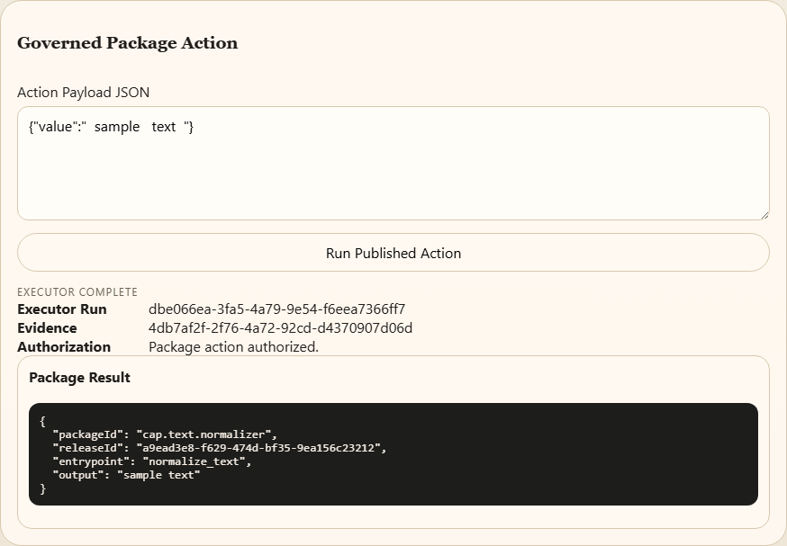

# From Python source to a recorded result

This walkthrough uses the bundled Text Normalizer. The browser and command-line routes exercise the actual TypeScript services and your Python interpreter. All example text is synthetic; no model account is required.

Install and build using the repository README, then run `npm run demo`. The script creates a new `.demo-runs/` directory, starts a disposable loopback runtime, and performs this sequence:

| Step | What happens | What to notice |
|---|---|---|
| Request the unpublished action | HTTP 403, executor status `denied` | No release means no published action can run. The denial is retained. |
| Validate | Structural validation passes | This is a package-contract check, not proof that arbitrary Python is safe. |
| Publish | Local version 1 is created | Source and generated forms are attached to the version. |
| Run | Python returns `hello world` | The executor records the authorized request and its result. |
| Save an uppercase draft, then run | Version 1 still returns `hello world` | Editing source does not silently replace the published execution target. |
| Validate and publish again | Version 2 returns `HELLO WORLD` | The same input now runs the newly published source. |
| Roll back to version 1 | New version 3 returns `hello world` | Rollback is another publication; it does not erase versions 1 or 2. |

The [captured JSON](../examples/result.json) is a public projection of that run. Full local records include execution identities, events, source artifacts, and machine paths; the demo retains them locally for inspection. Repeating the demo creates a new directory. For a chosen destination, use `node scripts/example.mjs --out NEW_DIRECTORY`; an existing destination is refused.

Open [trace.json](../examples/trace.json) to compare each release's exact source and SHA-256 beside the four executed calls. The input stays fixed. Each call checks that its authorization, action-evidence record and executor result refer to the same selected release/run. The final assertion compares the complete retained version 1 record against its original.

Those hashes identify source bytes; they do not establish safety. The trace deliberately omits generated IDs and machine paths. The complete local records retain them so an operator can follow an individual invocation.

## Through the interface

Run `npm run start:runtime`, open http://127.0.0.1:4310, and select **Text Normalizer** in **Package Workbench**. Read the two-line Python function. Choose **Validate**, then **Publish**. Scroll to **Governed Package Action**, leave the supplied payload in place, and choose **Run Published Action**.

The result should contain `"output": "sample text"`, executor status `complete`, and a package version. Notice that the action button was disabled before publication. Change the input and run again; each invocation gets its own evidence.

Use **Lifecycle Ledger** to inspect versions and **Execution Environment** to examine run records. Publishing here is entirely local. The runtime stops when you stop its terminal; saved records remain in `.skeleton-data/`.

To repeat the version comparison through the interface, save a changed draft before validating/publishing it. Run the published action between saving and publishing: it should still use the previous release. The automated demo exercises that same runtime API and leaves all versions for inspection. The screenshots show the original single-version browser walkthrough; this edition did not change the interface layout.

## If the example cannot complete

- A missing Python interpreter causes execution failure. Install Python 3.10+ or set `PYTHON_EXECUTABLE` to your interpreter, then restart the runtime.
- A busy port prevents browser startup. Stop the older runtime or set `PORT` to another local port. The scripted demo selects an available port automatically.
- Unsaved edits are not part of the draft. Choose **Save Draft** before validation/publication when changing source.

This prototype executes trusted Python with the runtime's permissions. Permission records are application rules, not OS isolation or authentication. See [SECURITY.md](../SECURITY.md).
